# Powdergame Interaction Graph & First Catalog Decisions

## Status

- Type: `DERIVED / CONTENT_DECISION`
- Authority: non-authoritative research; does not change `MATERIAL_SPEC`, `REACTION_SPEC`, M0 scope, or Evidence Gates.
- Purpose: turn the common-sense candidate pool into a concrete interaction graph and a first broad catalog decision.
- Supersedes the 38-entry selection in `FIRST_INTERACTION_ROSTER.md` for current research purposes.
- Operational policy checked against connected `Eeevah/personal-infra-wiki@98148d16a65965c9ceadf24e1fb5ed94f9bef37b`.
- No personal-infra-wiki update is required because this is speculative project research, not adopted cross-project operating policy.

> **A Material enters the game because it creates a different experiment, not because its name deserves a button.**

Inputs:

- `../../specs/MATERIAL_SPEC.md`
- `../../specs/REACTION_SPEC.md`
- `../../planning/MILESTONES.md`
- `MATERIAL_SELECTION_FRAMEWORK.md`
- `COMMON_SENSE_MATERIAL_CANDIDATE_POOL.md`
- `BLOCK_PALETTE_AND_PG2_GAP_REVIEW.md`
- `FIRST_INTERACTION_ROSTER.md`

---

## 1. Decision summary

The first broad content target becomes:

```text
16 foundation / catalog-direction identities
+ 29 promoted real/common identities
+ 1 provisional graph-derived slot
= 46 candidate identities
```

This number is **not M0 scope** and is not a promise that all 46 ship together.

The graph also separates:

- primary identities;
- manufactured/discoverable identities;
- staged results and variants;
- strong reserves;
- future systems;
- original gap-fillers.

The major change from the earlier 38 roster is that the first expansion now prefers familiar family decomposition:

```text
Metal → Iron / Copper / Lead / Mercury
Stone → Basalt / Obsidian / Limestone / Quartz
Plant → Tree / Vine / Moss / Fungus
```

before introducing fictional Matter.

The four earlier original gap-fillers:

```text
Pyrostor
Phase-Wax
Heat-Diode Material
Vapor-Latch
```

move to the **Original Gap Bench**. They remain valuable, but no longer consume first-catalog slots until real/common prototypes reveal a genuine missing verb.

---

## 2. Decision vocabulary

### `FOUNDATION`

Already in the current M0 set or initial catalog direction.

### `PROMOTE-IDENTITY`

Distinct Material identity worth prototyping after foundation proof.

### `DISCOVERABLE-RESULT`

A real Material identity that should primarily appear through a world transformation or manufacturing chain rather than as a new conceptual primitive.

### `STAGED-STATE / VARIANT`

Useful state or name, but initially represented as a transition stage, variant, or byproduct rather than a top-level identity.

### `PROVISIONAL-SLOT`

Graph analysis identifies a likely missing connector, but it must pass a prototype before promotion.

### `STRONG-RESERVE`

Clearly useful, but another candidate already covers most of its current interaction family.

### `FUTURE-SYSTEM`

Requires Electricity, Light, Radiation, richer Biology, Agents, or another system not justified by the current catalog.

### `REFERENCE-ONLY`

Good encyclopedia knowledge or visual/lore variation without a distinct gameplay verb.

### `ORIGINAL-GAP-BENCH`

A fictional Matter candidate retained only to fill a verb that reality and historical archetypes fail to provide.

---

## 3. First broad catalog candidate v1

## 3.1 Foundation — 16

### M0 validated target set — 9

```text
Boundary Block
Stone
Sand
Ice
Water
Steam
Smoke
Wood
Oil
```

### Existing catalog direction — 7

```text
Acid
Seed
Plant
Salt
Lava
Metal
Glass
```

`Fire` remains a combustion phenomenon/state.

Generic `Stone`, `Metal`, and `Plant` remain valid foundation abstractions. Specific family members do not invalidate them; they prove that the abstraction can later branch.

---

## 3.2 Promoted identities — 29

| Family | Identity | Catalog role | Distinct verb |
|---|---|---|---|
| Soil | Dirt | source Matter | support growth / become mud-like |
| Soil / manufacture | Clay | source Matter | wet / shape / fire |
| Manufacture | Brick | `DISCOVERABLE-RESULT` | fired clay becomes structure |
| Fuel | Coal | source Matter | burn slowly / produce strong Heat |
| Reactive mineral | Sulfur | source Matter | burn / react / join explosive family |
| Oxidizer precursor | Nitrate Salt / Saltpeter | source Matter | accelerate fuel reaction |
| Explosive | Gunpowder | manufactured Matter | rapid burn → Pressure |
| Liquid fuel | Alcohol | source/processed Matter | mix with Water / burn |
| Gas fuel | Methane | source Matter | accumulate / ignite |
| Phase-change | Dry Ice | source Matter | sublimate directly to CO2 |
| Gas modifier | CO2 | source/result Matter | sink / suppress combustion |
| Gas modifier | Oxygen | source Matter | amplify combustion without being fuel |
| Solution | Brine | `DISCOVERABLE-RESULT` | alter freezing / accelerate corrosion |
| Liquid metal | Mercury | source Matter | flow as extremely dense metal |
| Volcanic glass | Obsidian | `DISCOVERABLE-RESULT` | rapid-cool Lava result |
| Metal | Iron | source Matter | rust / structure / melt |
| Metal | Copper | source Matter | conduct Heat / oxidize in stages |
| Metal | Lead | source Matter | sink / melt earlier than structural peers |
| Rock | Basalt | `DISCOVERABLE-RESULT` | ordinary Lava cooling result |
| Mineral | Limestone / Calcite | source/result family | dissolve / precipitate |
| Mineral | Quartz / Crystal | source/growth family | nucleate / crystallize |
| Ecology | Tree | mature Plant identity/result | grow into Wood-producing structure |
| Ecology | Vine | source/growth identity | climb / follow surfaces |
| Ecology | Moss | source/growth identity | colonize wet mineral surfaces |
| Ecology | Fungus / Mold | source/growth identity | decompose organic Matter / spread |
| Absorption | Sponge | source/manufactured Matter | absorb Water / saturate |
| Surface chemistry | Soapy Water | processed Matter | capture Gas / form Foam |
| Explosive | Nitroglycerin-like Nitro | processed Matter | shock/Pressure-sensitive liquid reaction |
| Signal / manufacture | Fuse | manufactured Matter | propagate ignition slowly |

Notes:

- `Nitro` is a gameplay abstraction. Do not document real preparation conditions, ratios, or procedures.
- `Tree` may compile initially as a mature `Plant` stage while retaining a discoverable identity.
- `Brick`, `Brine`, `Basalt`, and `Obsidian` are promoted identities even if the player normally discovers them as results.
- `Quartz / Crystal` must prove visible growth or precipitation. If it becomes decorative-only, demote it to reserve.
- `Lead` must prove that density and melting contrast are visually meaningful. If not, demote it to reserve.

---

## 3.3 Provisional open slot — Ash

### Decision

`Ash` is the current **provisional winner** for the intentionally empty 46th slot.

### Why the graph exposes this gap

The existing combustion chain produces Heat and Smoke, but it lacks a persistent solid output that can become another system's input.

```text
Wood / Plant / Coal combustion
→ Heat
→ Smoke
→ Ash
```

Ash can then connect to:

```text
Ash + Water → slurry / lye-like future chemistry candidate
Ash + Dirt → soil/fertility modifier candidate
Ash + Binder/Cement family → construction additive candidate
Ash on Fire → smothering candidate
Wind/Gas movement → very light Powder transport
```

### Promotion gate

Ash becomes `PROMOTE-IDENTITY` only if a prototype shows at least two of:

1. combustion residue is visually readable;
2. Ash has movement distinct from Sand;
3. Ash can suppress or interfere with combustion without becoming an absolute extinguisher;
4. Ash becomes a useful input to soil or construction;
5. generating Ash does not make every combustion cell permanently expensive.

Until then it remains `PROVISIONAL-SLOT`.

---

## 4. Macro interaction graph

```mermaid
flowchart TD
    Heat((Heat))
    Pressure((Pressure))
    Water[Water]
    Oxygen[Oxygen]
    CO2[CO2]
    Acid[Acid]

    Dirt[Dirt]
    Mud[Mud state]
    Seed[Seed]
    Plant[Plant]
    Tree[Tree]
    Wood[Wood]
    Vine[Vine]
    Moss[Moss]
    Fungus[Fungus]

    Clay[Clay]
    WetClay[Wet Clay state]
    Brick[Brick]

    Lava[Lava]
    Basalt[Basalt]
    Obsidian[Obsidian]
    Limestone[Limestone / Calcite]
    Quartz[Quartz / Crystal]

    Salt[Salt]
    Brine[Brine]

    Iron[Iron]
    Rust[Rust state/result]
    Copper[Copper]
    Patina[Patina state/result]
    Lead[Lead]
    Mercury[Mercury]

    Coal[Coal]
    Sulfur[Sulfur]
    Nitrate[Nitrate Salt]
    Gunpowder[Gunpowder]
    Fuse[Fuse]
    Nitro[Nitro]
    Alcohol[Alcohol]
    Methane[Methane]
    Smoke[Smoke]
    Ash[Ash provisional]

    DryIce[Dry Ice]
    Sponge[Sponge]
    WetSponge[Saturated Sponge]
    Soapy[Soapy Water]
    Foam[Foam state/result]

    Water --> Mud
    Dirt --> Mud
    Dirt --> Plant
    Seed --> Plant
    Plant --> Tree
    Tree --> Wood
    Water --> Vine
    Water --> Moss
    Wood --> Fungus
    Plant --> Fungus

    Water --> WetClay
    Clay --> WetClay
    Heat --> Brick
    WetClay --> Brick

    Heat --> Basalt
    Lava --> Basalt
    Heat --> Obsidian
    Lava --> Obsidian
    Water --> Obsidian
    Water --> Pressure
    Lava --> Pressure
    Acid --> Limestone
    Limestone --> CO2
    Water --> Quartz

    Salt --> Brine
    Water --> Brine
    Brine --> Rust
    Iron --> Rust
    Oxygen --> Rust
    Copper --> Patina
    Oxygen --> Patina

    Coal --> Gunpowder
    Sulfur --> Gunpowder
    Nitrate --> Gunpowder
    Fuse --> Gunpowder
    Heat --> Fuse
    Heat --> Gunpowder
    Gunpowder --> Pressure
    Nitro --> Pressure
    Pressure --> Nitro

    Heat --> Alcohol
    Heat --> Methane
    Oxygen --> Alcohol
    Oxygen --> Methane
    CO2 --> Heat
    Gunpowder --> Smoke
    Coal --> Smoke
    Wood --> Smoke
    Coal --> Ash
    Wood --> Ash
    Plant --> Ash

    Heat --> DryIce
    DryIce --> CO2

    Water --> WetSponge
    Sponge --> WetSponge
    Heat --> WetSponge
    Soapy --> Foam
    Pressure --> Foam
```



The graph is intentionally semantic, not a runtime execution order. It shows which concepts must become observable causal links.

---

## 5. Canonical interaction ledger

## 5.1 Terrain, geology and manufacturing

| ID | Causal chain | Primary owner | Cost class | Discovery event |
|---|---|---|---|---|
| `SOIL-01` | Dirt + Water → Mud-like stage | Dirt | local transition | `ConsistencyChanged` |
| `SOIL-02` | Dirt + Seed + Water → Plant growth eligibility | Seed/Plant | local growth candidate | `GrowthStarted` |
| `CLAY-01` | Clay contacting Water → Wet Clay stage | Clay | local transition | `MaterialSoftened` |
| `CLAY-02` | Wet Clay + Heat → Brick | Wet Clay | thermal transition | `FiringObserved` |
| `LAVA-01` | Lava + moderate cooling → Basalt | Lava | thermal transition | `SolidificationObserved` |
| `LAVA-02` | Lava + rapid cooling → Obsidian | Lava | thermal transition | `RapidCoolingObserved` |
| `LAVA-03` | Lava + Water → Steam + Pressure; cooling result selected separately | Water/Lava self-rules + spawn claim | M0 grammar | `SteamGenerated`, `PressureGenerated` |
| `LIME-01` | Limestone + Acid → dissolution + CO2 candidate | Limestone | local reaction + spawn claim | `DissolutionObserved`, `GasGenerated` |
| `CRYS-01` | Quartz seed + mineral-bearing condition → staged Crystal growth | Quartz | local growth candidate | `CrystalGrowthObserved` |

`CRYS-01` must not require a universal dissolved-mineral float. A small staged material or explicit source tag is preferred for the prototype.

## 5.2 Solution, corrosion and metal differentiation

| ID | Causal chain | Primary owner | Cost class | Discovery event |
|---|---|---|---|---|
| `SALT-01` | Water sees Salt → Brine self-transition; Salt dissolves through its own local rule | Water/Salt | paired self-rules | `DissolutionObserved` |
| `SALT-02` | Brine + cold → altered freezing threshold | Brine | thermal property | `FreezingChanged` |
| `IRON-01` | Iron + Water/Oxygen condition → Rust stage | Iron | local staged transition | `CorrosionObserved` |
| `IRON-02` | Brine accelerates Iron corrosion | Iron | rule threshold modifier compiled for Iron | local only |
| `COPR-01` | Copper + moisture/Oxygen → Patina stages | Copper | staged transition | `OxidationObserved` |
| `ACID-01` | Acid contact → eligible Metal self-corrosion | target Metal | material-owned rule | `CorrosionObserved` |
| `METL-01` | Iron/Copper/Lead + high Heat → molten stage | each Metal | thermal transition | `MeltingObserved` |
| `DENS-01` | Lead/Mercury rank below common liquids and powders | movement class/property | existing density grammar | `SinkingObserved` |

Rust and Patina should begin as staged identities rather than universal `oxidation_progress` bytes.

## 5.3 Combustion, atmosphere and delayed causality

| ID | Causal chain | Primary owner | Cost class | Discovery event |
|---|---|---|---|---|
| `COMB-01` | Wood/Oil/Coal/Alcohol/Methane + sufficient thermal condition → combustion | fuel | shared grammar | `IgnitionObserved` |
| `COMB-02` | Oxygen nearby lowers effective ignition difficulty or raises burn intensity | fuel compiled rule | local modifier | `CombustionAccelerated` |
| `COMB-03` | CO2 nearby reduces combustion continuation/intensity | combusting fuel | local modifier | `CombustionSuppressed` |
| `GUNP-01` | Gunpowder ignition → rapid Heat + Pressure + Smoke/residue | Gunpowder | shared combustion with extreme rate | `RapidCombustionObserved` |
| `NITR-01` | Nitro receives strong Pressure/impact event → rapid reaction | Nitro | Pressure-triggered transition | `ShockTriggeredReaction` |
| `FUSE-01` | burning Fuse ignites adjacent Fuse gradually | Fuse | local propagation | `DelayedIgnitionObserved` |
| `FUSE-02` | burning Fuse contacts Gunpowder/Nitro → target reads hot/combusting neighbor | target | existing neighbor read | ordinary ignition event |
| `DRYI-01` | Dry Ice + Heat → CO2 | Dry Ice | thermal transition | `SublimationObserved` |
| `ASH-01` | consumed organic/solid fuel → Ash request | combusting material | spawn claim, provisional | `ResidueGenerated` |

Oxygen remains an amplifier, not a retroactive M0 requirement. CO2 remains a local suppressor, not a full atmosphere solver.

## 5.4 Absorption, foam and surface behavior

| ID | Causal chain | Primary owner | Cost class | Discovery event |
|---|---|---|---|---|
| `SPNG-01` | Sponge + Water contact → Saturated Sponge stage | Sponge | staged transition | `AbsorptionObserved` |
| `SPNG-02` | Saturated Sponge + Heat/approved mechanical condition → Water release | Saturated Sponge | transition + spawn claim | `ReleaseObserved` |
| `SOAP-01` | Soapy Water + nearby Gas/disturbance → Foam request | Soapy Water | local spawn claim | `FoamGenerated` |
| `FOAM-01` | Foam traps/slows Gas and collapses under Heat/Oil | Foam | movement/property + transition | `FoamCollapsed` |

Do not add a generic `capacity8` to every Cell for Sponge. Initial implementation should use discrete Dry/Saturated identities or a very small Sponge-only state justified by benchmark.

## 5.5 Ecology and propagation

| ID | Causal chain | Primary owner | Cost class | Discovery event |
|---|---|---|---|---|
| `TREE-01` | Plant under suitable substrate/water/time → Tree stage | Plant | staged growth | `MaturationObserved` |
| `VINE-01` | Vine grows into eligible cells adjacent to a support surface | Vine | spawn claim | `SurfaceGrowthObserved` |
| `MOSS-01` | Moss colonizes wet Stone/Brick/Limestone surfaces | Moss | local growth + claim | `ColonizationObserved` |
| `FUNG-01` | Fungus consumes eligible damp organic substrate and propagates | Fungus/substrate paired rules | transition + claim | `DecompositionObserved` |
| `BIO-HEAT` | high Heat/combustion kills or chars biological growth | biological Matter | thermal transition | `BiomassDestroyed` |

A real biological Virus remains `FUTURE-SYSTEM`. Universal arbitrary-dot conversion is not part of this catalog.

---

## 6. Rule-ownership notes

The graph must respect `Read Neighbors, Write Self`.

### Preferred paired-self pattern

Example: Salt dissolving into Water.

```text
Water:
  sees Salt
  → self becomes Brine

Salt:
  sees Water or Brine
  → self dissolves / becomes EMPTY through an approved ownership path
```

The exact consumption balance is a prototype question. Do not introduce direct arbitrary neighbor writes merely to make the equation look chemically neat.

### Spawn / occupancy changes

The following may require Claim/Resolve:

- Steam, CO2, Smoke, Ash or Foam generation;
- Vine/Moss/Fungus growth into an empty cell;
- released Water from Saturated Sponge;
- crystal growth;
- rupture openings.

These should use the same ownership mechanism already required by movement/spawn, not a new reaction-specific global pass.

### Multi-ingredient production

The graph distinguishes **world interaction** from **production discovery**.

```text
Coal + Sulfur + Nitrate → Gunpowder
```

is a strong Doodle-God-like production relationship, but does not automatically imply a three-neighbor hot-path rule.

Possible later authoring paths:

- mixture/material processor;
- repeated local contact in a mixing zone;
- structure/device recipe;
- editor discovery rule.

The runtime hot path must not scan arbitrary ingredient sets.

---

## 7. Graph hubs and weak nodes

## 7.1 Strong hubs

### Water

Connects phase change, Dirt, Clay, Salt/Brine, Lava/Steam, Sponge, growth, Moss, corrosion and later deposition.

### Heat

Connects phase change, combustion, firing, metal melting, Lava solidification, Dry Ice sublimation, biological death and material release.

### Pressure

Connects Steam confinement, Gunpowder, Nitro, rupture, venting and Foam disturbance.

### Acid

Connects generic corrosion, Limestone dissolution and later chemistry counters.

### Oxygen / CO2

Provide opposing local combustion modifiers without demanding a full atmosphere model.

### Dirt / Plant / Wood

Connect terrain, growth, manufactured biomass, combustion and decomposition.

## 7.2 Borderline promoted nodes

### Lead

Keep promoted only if these are visually meaningful:

- markedly different sinking;
- lower melting behavior than Iron/Copper;
- future shielding reuse.

Otherwise demote to `STRONG-RESERVE`.

### Quartz / Crystal

Keep promoted only if staged growth/precipitation becomes a visible toy.

If it is merely “pretty Stone,” demote it.

### Tree

Keep as a discoverable identity, but it may compile as a mature Plant stage rather than requiring a totally separate movement/agent architecture.

### Soapy Water

Keep only with Foam. Without a readable bubble/foam result, it overlaps ordinary Water too much.

---

## 8. Strong reserve decisions

| Candidate | Decision | Re-entry trigger |
|---|---|---|
| Methane Clathrate | `STRONG-RESERVE / first exotic` | Methane + Pressure chain proven |
| Aerogel | `STRONG-RESERVE` | thermal insulation + pressure fracture readable |
| Perchlorate Dust | `STRONG-RESERVE` | local oxidizer modifier proven |
| Snow | `STRONG-RESERVE` | POWDER cold behavior clearly differs from Ice |
| Gravel | `STRONG-RESERVE` | coarse grain movement differs cheaply |
| Pumice | `STRONG-RESERVE` | porous/light rock visibly changes density play |
| Dripstone / Travertine | `STRONG-RESERVE` | mineral-bearing Water/deposition exists |
| Amethyst | `STRONG-RESERVE / Quartz variant` | crystal growth earns a second exemplar |
| Aluminum | `STRONG-RESERVE` | light-metal construction matters |
| Zinc | `STRONG-RESERVE` | corrosion protection exists |
| Gold | `STRONG-RESERVE` | Electricity/corrosion makes resistance useful |
| Tungsten | `STRONG-RESERVE` | high-temperature engineering exists |
| Hydrogen | `STRONG-RESERVE` | gas buoyancy contrast is proven |
| Ammonia | `STRONG-RESERVE` | toxic/refrigeration/fertilizer family exists |
| Resin | `STRONG-RESERVE` | adhesion/hardening semantics exist |
| Tar | `STRONG-RESERVE` | viscosity visibly differs from Oil |
| Base / Alkali | `STRONG-RESERVE` | chemistry needs a readable Acid counter |
| Cement / Concrete | `STRONG-RESERVE` | Clay → Brick manufacturing succeeds |
| Ceramic | `STRONG-RESERVE` | heat resistance + brittleness matters |
| Rubber | `STRONG-RESERVE` | elasticity/electricity exists |
| Algae | `STRONG-RESERVE` | Water ecology and gas/light hooks exist |
| Bacteria | `STRONG-RESERVE` | microscopic conversion can be made readable |
| Fertilizer | `STRONG-RESERVE` | growth consumes resources |
| Thermite-like mixture | `STRONG-RESERVE` | Metal melting is fun; recipe stays abstract |
| Wax | `STRONG-RESERVE` | waterproofing/low-temperature phase change earns it |

---

## 9. Result / variant decisions

Start these as non-primary identities or staged states:

```text
Mud
Wet Clay
Molten Iron / Copper / Lead
Rust
Copper Patina
Foam / Bubbles
Saturated Sponge
Charcoal
Sandstone
Tempered Glass
Paper
```

Promotion to a primary identity requires a new player-facing verb, not just a different texture.

---

## 10. Future and explicit defer

### Future systems

```text
Virus / infection of living Matter
Bacteria with invisible conversion
Blood / Bone / Chitin
Poison Gas affecting Agents
Electric conductors beyond thermal behavior
Magnetism / Ferrofluid
Light / Tinted Glass
Radiation / Lead shielding
Cloud / weather
Pump / Conveyor structures
```

### Meta defer

```text
universal transmutation virus
time manipulation
probability manipulation
observation-dependent behavior
teleportation
arbitrary deletion
gravity rewrite
civilization / language / religion as Cell Matter
```

These may become Agent, Field, Structure, Concept or Meta systems rather than Matter.

---

## 11. Original Gap Bench

Do not promote an original Matter merely because the encyclopedia already contains it.

| Candidate | Gap it might fill | Reality-first competitor | Promotion condition |
|---|---|---|---|
| Pyrostor | delayed Heat storage/discharge | wax/phase-change storage, thermal mass | real candidates fail to create readable delayed release |
| Phase-Wax | portable latent-Heat buffer | real wax / phase-change material | ordinary wax lacks sufficient gameplay contrast |
| Heat-Diode Material | directional Heat construction | layered/anisotropic real material abstraction | orientation is cheap and creates useful devices |
| Vapor-Latch | finite Gas/Steam capture | Sponge, clathrate, porous mineral | ordinary absorption cannot express pressure-triggered release |
| Baroclast | Pressure-driven structure change | foam, porous rock, flexible structures | Pressure remains explosion-only after real materials |
| Transmuting Contamination | arbitrary Matter infection | Fungus, Rust, Virus, crystal growth | eligible-substrate propagation is still too narrow |

The default outcome is that many of these remain research-only. That is healthy.

---

## 12. Prototype sequence

The sequence follows engine dependencies, not encyclopedia order.

## P1 — Geology and irreversible manufacture

```text
Dirt / Water / Mud stage
Clay / Wet Clay / Brick
Lava / Basalt / Obsidian
Limestone / Acid / CO2
```

**Pass evidence**

- cooling rate visibly changes Lava result;
- Brick feels manufactured rather than recolored Stone;
- Limestone dissolution is readable;
- no universal moisture/corrosion floats are introduced.

## P2 — Combustion control and delayed trigger

```text
Coal
Gunpowder
Fuse
Dry Ice / CO2
Oxygen modifier
Ash provisional
```

**Pass evidence**

- Gunpowder differs from ordinary fuel through reaction rate and Pressure;
- Fuse produces predictable delay using local propagation;
- Oxygen amplifies but is not mandatory;
- CO2 suppresses locally;
- Ash either becomes a useful solid output or is rejected.

## P3 — Metal family and corrosion

```text
Iron / Rust
Copper / Patina
Lead
Mercury
Brine
Acid
```

**Pass evidence**

- Iron and Copper age differently;
- Lead and Mercury are visibly distinct through movement/density/phase;
- corrosion is staged through Material identities;
- stable metal worlds can sleep rather than tick forever.

## P4 — Absorption and Foam

```text
Sponge / Saturated Sponge
Soapy Water / Foam
```

**Pass evidence**

- absorption has finite, readable capacity without a universal Cell byte;
- Foam behaves as more than decorative Gas;
- release/collapse chains create another interaction.

## P5 — Ecology topology

```text
Tree
Vine
Moss
Fungus
```

**Pass evidence**

- each growth form has a visibly different topology;
- growth consumes or requires eligible substrate;
- Fire/Heat is a clear counter;
- the system does not become a generic arbitrary-material Virus.

## P6 — Trigger contrast

```text
Gunpowder: Heat/ignition-sensitive Powder
Nitro: Pressure/impact-sensitive Liquid
```

**Pass evidence**

- the two explosives invite different experiments;
- Nitro remains an abstract gameplay material;
- no real preparation instructions or recipe ratios enter game documentation.

---

## 13. Promotion gate

A candidate may move from research to an adopted content proposal only when it satisfies:

1. **Readable identity** — behavior can be explained in one sentence.
2. **Distinct verb** — not already covered by another Matter.
3. **Graph value** — at least three meaningful links, or one chain of five or more steps.
4. **Local execution** — no new full-world pass by default.
5. **State discipline** — no universal future Cell state added speculatively.
6. **Counter/failure** — strong behavior has a limit or counter.
7. **Discovery event** — at least one phenomenon the player can observe and record.
8. **Prototype evidence** — the interaction is fun and readable in the production simulation.
9. **User approval** — adoption into SPEC/catalog direction remains a human decision.

---

## 14. Historical worldview layer

Classical elements remain discovery categories rather than duplicate Matter:

```text
Earth  → Dirt / Stone / Clay / mineral families
Water  → Water / Ice / Steam / Brine
Air    → Oxygen / CO2 / Methane / later atmosphere
Fire   → combustion phenomenon
Aether → future exotic category
```

The alchemical trio bridges history and runtime Matter:

```text
Salt    → dissolution / crystallization / fixation
Sulfur  → combustion / activation / transformation
Mercury → fluidity / metal / transformation
```

This gives the catalog mythic texture without inventing arbitrary early magic.

---

## 15. Current conclusion

The current catalog direction is not “46 elements to implement.”

It is:

```text
a compact vocabulary
+ a dense causal graph
+ explicit result states
+ reserves that enter only when a verb is missing
```

The immediate content-design target is the six prototype bundles above.

M0 remains unchanged. The next authority-changing step, if prototypes succeed, is a separate human-reviewed content proposal or ADR/SPEC update—not an automatic promotion from this research document.
